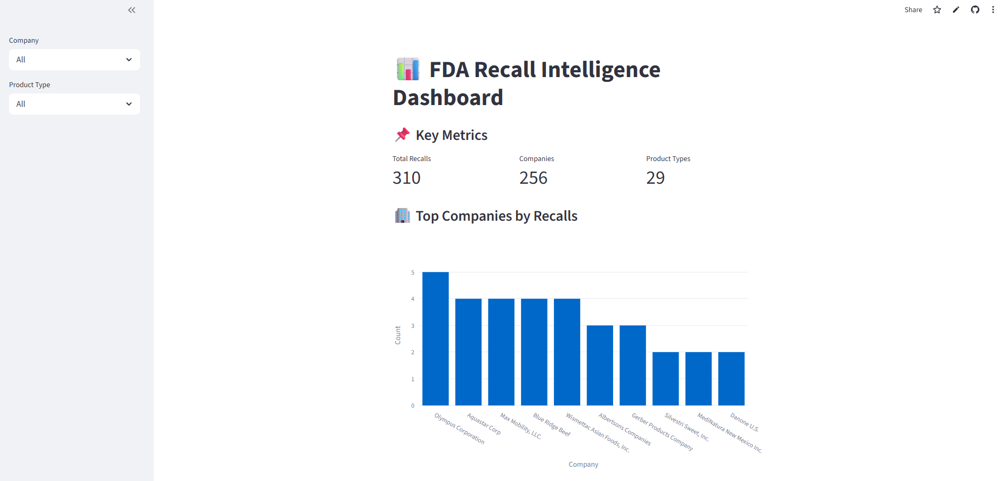

# 📊 FDA Recall Intelligence Dashboard (AI + Data Analytics)

An interactive data analytics and AI-ready dashboard built using **Python, Streamlit, and FDA open data** to analyze healthcare product recalls.

---

## 🚀 Live App
👉  https://fda-recall-ai-dashboard.streamlit.app/

---

## 🎯 Project Objective
To analyze FDA recall data and identify:
- High-risk product categories
- Companies with repeated recalls
- Trends in healthcare safety issues over time

---

## 🧠 Key Features
- 📊 Interactive Streamlit dashboard
- 🔍 Filter by Company and Product Type
- 📈 Visual trends (recalls over time)
- 🏢 Top recalling companies analysis
- 📦 Product category risk distribution
- ⚡ Clean data pipeline using Pandas

---

## 🛠️ Tech Stack
- Python
- Pandas
- Streamlit
- Plotly
- Git/GitHub

---

## 📂 Project Structure

```text
fda_ai_project/
│
├── app/
│ └── app.py
├── data/
│ └── recalls_raw.csv
├── notebooks/
├── requirements.txt
├── README.md
```

---

## 📊 Sample Insights
- Identifies top companies with highest recall frequency
- Tracks yearly recall trends
- Highlights dominant product risk categories

---

## 💡 Future Enhancements
- AI-powered recall summarization (LLM integration)
- RAG-based FDA Q&A chatbot
- Risk scoring model for recalls

---

## 👨‍💻 Author
Humera Anjum 
Aspiring Data Analyst | AI + Healthcare Analytics

## 📸 Dashboard Preview

### Main Dashboard


### Trends Analysis
